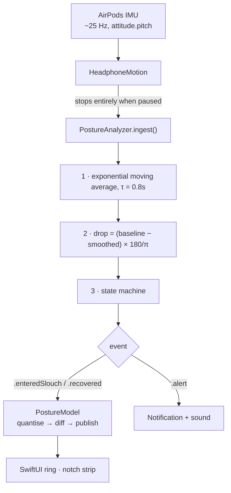

# Posture

A small macOS app that reads the motion sensors in your AirPods and tells you
when you've been slouching. The live reading sits beside the notch.

No camera. No account. No network code — `otool -L` shows nothing outside the
system libraries. The whole app is 776K.

**https://posture.einargudni.com**

---

## Requirements

| | |
|---|---|
| Hardware | AirPods Pro, AirPods 3rd gen or later, AirPods Max, Beats Fit Pro |
| System | macOS 14 or later, Apple Silicon |
| Toolchain | Xcode 16+ (Swift 6), only if building yourself |

## Build

```sh
git clone https://github.com/einargudnig/posture.git
cd posture
./build.sh && open build/Posture.app
```

Then sit up straight and press **Calibrate**. That's the whole setup.

`build.sh` prefers a Developer ID identity if you have one and falls back to
ad-hoc signing if you don't — see [Signing](#signing-is-identity-is-permissions)
for why that matters more than it sounds.

---

## How it works

### Where the data comes from

Motion-capable AirPods contain a 6-axis IMU — accelerometer plus gyroscope —
that Apple ships for spatial audio head tracking. `CMHeadphoneMotionManager`
exposes it, and since macOS 14 that API is available on the Mac, not just iOS.

The critical property is *which* angle gets used:

- **pitch and roll** are fused with the accelerometer against gravity, so they
  are absolute and drift-free.
- **yaw** is integrated from the gyroscope alone, so it wanders continuously.

Pitch being gravity-referenced is what makes "how far is my head tilted down" a
stable measurement that means the same thing an hour later. The entire app is
built on that one axis for that one reason.

### The pipeline



**Smoothing** uses `alpha = 1 - exp(-dt / 0.8)` rather than a fixed alpha. The
sample rate wobbles, and a fixed alpha would silently change the filter's time
constant when it did. This is what stops a single 40 ms spike — a sneeze, a
laugh — from registering.

**Calibration** takes 3 seconds of samples and stores the **median**, not the
mean. One head-turn during calibration would drag a mean noticeably; it barely
moves a median.

### The decision

`PostureAnalyzer.advance()` is a three-state machine:

```
 good ──────────── drop > 12° ─────────────▶ slouching
      ◀────────── drop < 12° − 5° ─────────
                                             │ held ≥ 25s, and past cooldown?
                                             ▼
                                           alert
```

| Knob | Default | What it buys |
|---|---|---|
| `thresholdDegrees` | 12° | How far down counts as slouching |
| `recoveryDegrees` | 5° | Hysteresis — stops state flicker at the boundary |
| `sustainSeconds` | 25s | Grace period — glancing at your keyboard is free |
| `cooldownSeconds` | 2 min | Gap before the next nudge |
| `maxCooldownSeconds` | 30 min | Floor on how quiet it's allowed to get |

Hysteresis and the grace period solve different problems and neither substitutes
for the other. Hysteresis stops *state flicker* when you hover exactly at the
limit; the grace period stops *false positives* from deliberate downward glances.
Remove either and it becomes unusable in a different way.

### The part that isn't in any other posture app

Every competitor detects a slouch and alerts, forever, at a fixed interval. None
of them model what happens when you *ignore* the alert — which is why they get
muted in week two.

Here, **each nudge you ignore doubles the wait before the next one**:

```
currentCooldown = min(120 × 2^(ignoredNags − 1), maxCooldown)

nudges at:  t+25s → +2m → +4m → +8m → +16m → +30m → +30m …
```

`ignoredNags` resets to zero on the `.recovered` transition, so **sitting up is
the only thing that restores full strength**. The back-off can't quietly expire
on its own, which keeps the incentive pointed the right way. The cap exists so
it never fully gives up.

The bet: ignoring a nudge usually means you're deep in something, and an app
that gets quieter when you're busy is one you don't reach for the mute button
on. The cost is real — on a genuinely bad day it fades to a nudge every half
hour and mostly lets you do it.

### Why it costs nothing to run

`PostureModel` feeds the analyzer at the full 25 Hz but publishes to SwiftUI at
most 10 Hz, and only when the *rendered* values change — degrees quantised to
0.5°, the session clock to whole seconds, upright% to whole percent. A still head
produces an identical snapshot and therefore zero UI work. The sparkline only
accumulates while a window is actually on screen, and pausing tears the sensor
down rather than ignoring its samples.

| | before | after |
|---|---|---|
| CPU, window open | 8–16% | **0.13%** |
| CPU, window closed | — | **0.133%** |
| Memory (RSS) | 132 MB | **85 MB** |

The original bug wasn't the sensor. Nine separate `@Published` writes per tick,
on a model observed by the `App` struct, made SwiftUI rebuild the app's main
menu and Dock menu ten times a second. `sample` found it in one pass —
`publish()` → `PostureApp.body.getter` → `AppKitMainMenuItem.updateMenuHost`.

### Signing is identity is permissions

macOS keys permission grants — Motion & Fitness, notifications — to the code's
**designated requirement**, not to the bundle ID alone.

```
ad-hoc:        designated => cdhash H"2bf84c4ce214ede6…"
Developer ID:  designated => identifier "is.einargudni.posture" and anchor apple
                              generic and … certificate leaf[subject.OU] = "…"
```

The ad-hoc requirement is a hash of the binary, so *every rebuild* looks like a
different app and re-prompts for everything. A Developer ID requirement is
identifier + team and never changes. If an app keeps asking for permission,
that's almost always a signing problem rather than a permissions-API problem.

The bundle ID is also the primary key for the UserDefaults domain, the TCC
grant, notification authorization, and `SMAppService` login-item registration —
changing it orphans all four.

---

## Layout

```
Sources/
  PostureAnalyzer.swift   pure state machine — no clocks, no I/O, no UI
  HeadphoneMotion.swift   CMHeadphoneMotionManager wrapper
  PostureModel.swift      sensor + analyzer → one diffed @Published snapshot
  PostureApp.swift        Window + Settings scenes, app delegate
  NotchHUD.swift          the live strip beside the notch
  WindowKeeper.swift      hides the window instead of closing it
  ContentView.swift       the one window
  PostureGauge.swift      ring gauge + sparkline
  SettingsView.swift      General / Alerts / Advanced
  Prefs.swift             UserDefaults
  Probe.swift             `--probe`: live angles in the terminal
Tests/                    11 tests over the state machine
scripts/
  make-icon.swift         renders the .icns from code
  release.sh              sign → notarize → staple → publish
site/                     the landing page (Astro)
```

`PostureAnalyzer` takes `(pitch, timestamp)` and returns an event. No clocks, no
I/O, no UI — which is why the tests can replay 250 simulated seconds in 17 ms and
assert exact nudge timestamps like `[10, 70, 190, 430, 910]`.

```sh
swift test
```

### Debugging the sensor

```sh
./build/Posture.app/Contents/MacOS/Posture --probe
```

Prints availability, authorization status, and live pitch. Reach for it first
when something seems wrong — it separates "AirPods aren't streaming" from
"threshold is off", and it's how you'd confirm which way pitch moves on your
hardware if you ever needed the **Invert pitch** setting.

---

## What it can't do

It measures your **head**, not your spine. It catches the screen-slump well,
because that is what hunching does to your neck. It cannot tell leaning back in a
well-aligned chair from sitting bolt upright, and it will read a long look down
at a notebook as a slouch until the grace period filters it out.

It's a nudge, not a measurement of your health.
